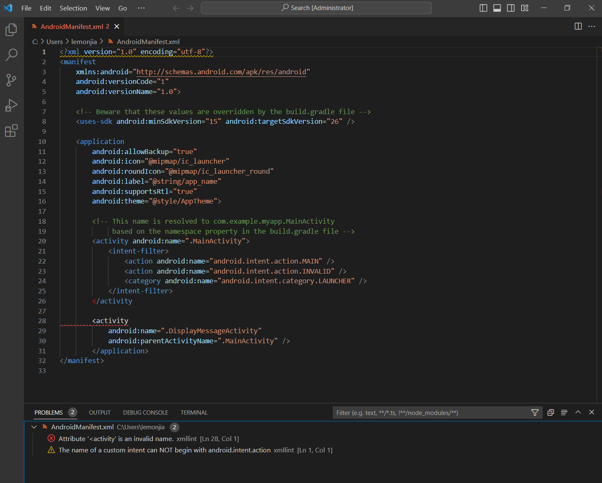

# xmllint-vscode

[](https://github.com/devops-lintflow/xmllint-vscode/tags)


## Introduction

*xmllint-vscode* is a VS Code extension as XML code style checker within
Visual Studio Code, forked from https://github.com/secularbird/cpplint-extension.


## Features




## Install

```bash
yarn
vsce package
vsce publish
```


## License

Project License can be found [here](LICENSE).


## Reference

- [publishing-extension](https://code.visualstudio.com/api/working-with-extensions/publishing-extension)
